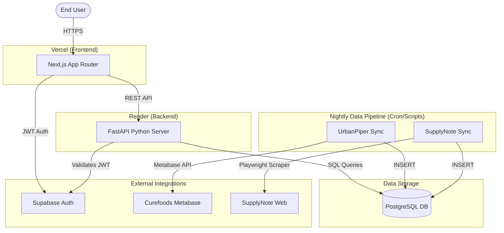

# System Architecture

## Current Real-World Architecture

## How They Connect
1. **Frontend to Backend:** The Next.js frontend calls the FastAPI backend via REST (Axios). The base URL is controlled by `NEXT_PUBLIC_API_URL` (usually pointing to `https://demand-planning-8r9g.onrender.com`).
2. **Authentication:** The frontend authenticates directly with Supabase via the JS client, receives a JWT, and passes it in the `Authorization: Bearer <token>` header to the backend. The backend uses the Supabase Python client to validate the token.
3. **Backend to DB:** FastAPI uses `psycopg2` and `pandas` (`read_sql_query`) to fetch data directly from the PostgreSQL database.
4. **Data Ingestion:** Independent Python scripts run periodically to extract data from external sources and load it into PostgreSQL.
